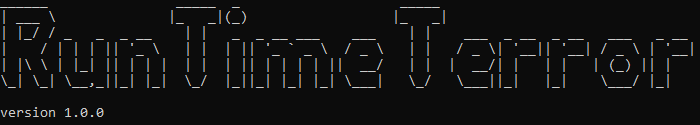
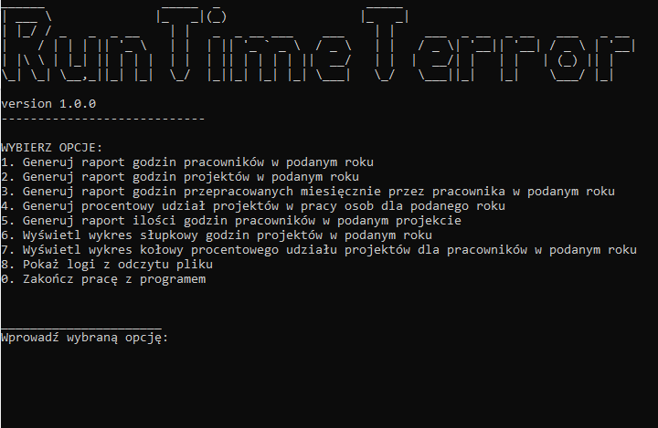

<!-- PROJECT SHIELDS -->
<!--
*** I'm using markdown "reference style" links for readability.
*** Reference links are enclosed in brackets [ ] instead of parentheses ( ).
*** See the bottom of this document for the declaration of the reference variables
*** for contributors-url, forks-url, etc. This is an optional, concise syntax you may use.
*** https://www.markdownguide.org/basic-syntax/#reference-style-links
-->


<!-- PROJECT LOGO -->
<br />
<p align="center">
  <a href="https://github.com/bszczepa/RuntimeTerror">
    
  </a>

  <h3 align="center">RunTime Terror Reporting Tool ver 1.0</h3>

  <p align="center">
    Konsolowe narzędzie do raportowania w obszarze Project Managementu, stworzone przez zespół RunTime Terror w składzie:
    <br /> >> <a href="https://github.com/AnnaMadej"> Anna Madej </a>
    <br /> >> <a href="https://github.com/sloppysheep"> Aleksandra Wandzilak </a>
    <br /> >> <a href="https://github.com/martatomalska"> Marta Tomalska </a>
    <br /> >> <a href="https://github.com/zawibe"> Beata Zawidlak-Cyganek </a>
    <br /> >> <a href="https://github.com/mateuszsutor"> Mateusz Sutor </a>
    <br /> >> <a href="https://github.com/bszczepa"> Bartosz Szczepański </a>
    <br/> 
  </p>
  <p>
    Program odczytuje z plików xls dane o przepracowanych godzinach danego pracownika w różnych projektach z uwzględnieniem poszczególnych zadań a następnie używa odczytanych danych do budowania raportów, które można eksportować do plików xls a także tworzyć wykresy.
  </p>
</p>


<!-- TABLE OF CONTENTS -->
## Spis treści

* [O projekcie](#o-projekcie)
* [Dokumentacja](#dokumentacja)
  * [Wymagania](#wymagania)
  * [Instalacja](#instalacja)
* [Uruchomienie](#uruchomienie)
  * [Korzystanie](#korzystanie)
  * [Obsługa błędów](#obsluga-bledow)
* [Roadmapa](#roadmapa)
* [Licencja](#licencja)


<!-- ABOUT THE PROJECT -->
## O projekcie

   <br />
  <a href="https://github.com/AnnaMadej/reporter-mwo">
    
  </a>
   <br />
   <br />
   
Narzędzie do raportowania uwzględniające następujące funkcjonalności:
 - Wczytywanie danych z plików w podanym folderze
 - Interfejs konsolowy CLI
 - Generowanie raportu godzin pracowników w danym roku
 - Generowanie raportu godzin projektów w podanym roku
 - Generowanie raportu godzin przepracowanych miesięcznie przez pracownika w podanym roku
 - Generowanie raportu procentowego udziału projektów w pracy osób dla podanego roku
 - Generowanie raportu ilości godzin pracowników w podanym projekcie
 - Generowanie wykresu słupkowego ilości godzin projektów w podanym roku
 - Generowanie wykresu kołowego procentowego udziału projektów dla pracowników w podanym roku
 - Eksportowanie raportów do plików MS Excel
 - Jeden plik wykonywalny JAR
 - Obsługa błędów oraz ich specyfikacja

<!-- GETTING STARTED -->
## Dokumentacja

### Wymagania

- co najmniej Java 8 SE Runtime Environment
- wiersz poleceń

### Instalacja

Sklonuj Runtime Terror
```sh
git clone https://github.com/AnnaMadej/reporter-mwo
```
 Zainstaluj zależności Mavenowe i stwórz plik JAR
```sh
mvn install
```
W podkatalogu Target pojawi się plik RuntimeTerror-1.0-shaded.jar.


<!-- USAGE EXAMPLES -->
## Uruchomienie

Uruchom wiersz poleceń wpisując "cmd" w Menu Start.

Aby uruchomić narzędzie należy w wierszu poleceń wejść w katalog zawierający plik RuntimeTerror-1.0-shaded.jar 
i użyć komendy:

```sh
java -jar RuntimeTerror-1.0-shaded.jar "ścieżkaDoFolderuZPlikamiDanych"
```
np. 
```sh
java -jar RuntimeTerror-1.0-shaded.jar "C:\Users\aniam\Desktop\reporter-dane2"
```

### Odczytywanie z plików
## Wymagania dla plików wejściowych xls:
- Plik musi znajdować się w katalogu [ROK]/[MIESIĄC] (RRRR/MM) (na przykład 2012/01)
- Plik musi mieć nazwę [Nazwisko_imię.xls] (na przykład Nowak_Jan.xls)
<br>
- Prawidłowa lokalizacja pliku: <b> 2012/01/Nowak_Jan.xls </b> 
<br>
<p> Poszczególne projekty, w których uczestniczył pracownik to osobne arkusze pliku xls. (nazwy arkuszy to nazwy projektów) </p>
<p> Każdy arkusz musi zawierać kolejno kolumny o nagłównach Data, Zadanie, Czas[h] </p> 
<br>
<p> Przykładowy plik xls: https://github.com/AnnaMadej/reporter-mwo/raw/master/src/test/testing-data/reporter-dane-z-bledami/2014/05/Nowak_Piotr.xls </p>


### Korzystanie

Aby wywołać relewantną funkcję należy podać nr odpowiedniej opcji z interfejsu, następnie postępować wedle wskazówek programu. 

### Obsluga bledow

Program przeprowadza wstępną walidację poniższych błędów - wiersze błędne są nieuwzględniane w dalszych obliczeniach.

- pusty wiersz
- pusta komórka
- komórka nie zawiera daty
- pusta komórka 
- komórka nie zawiera opisu
- komórka nie zawiera czasu
- komórki nie zawierają wartości numerycznej
- źle wpisana data
- nieprawidłowy rok w dacie
- nieprawidłowy miesiąc w dacie
- arkusz nie zawiera odpowiednich kolumn
- zsumowala liczba godzin pracownika w danym dniu jest większa niż 24

Listę błędów i zignorowanych wierszy można zobaczyć wybierając funkcję nr 8 w głównym menu.
Jeżeli błąd wystapi na poziomie pliku (na przykład zsumowana liczba godzin któregoś dnia się nie zgadza), żadne dane z tego pliku nie zostaną wczytane do programu. 
Analogicznie, jeżeli błąd wystąpił na poziomie wiersza (któraś z kolejnych komórek nie jest prawidłowo wypełniona), dane z tego wiersza nie zostaną wczytane do programu.


<!-- MARKDOWN LINKS & IMAGES -->
<!-- https://www.markdownguide.org/basic-syntax/#reference-style-links -->
[contributors-shield]: https://img.shields.io/github/contributors/othneildrew/Best-README-Template.svg?style=flat-square
[contributors-url]: https://github.com/othneildrew/Best-README-Template/graphs/contributors
[forks-shield]: https://img.shields.io/github/forks/othneildrew/Best-README-Template.svg?style=flat-square
[forks-url]: https://github.com/othneildrew/Best-README-Template/network/members
[stars-shield]: https://img.shields.io/github/stars/othneildrew/Best-README-Template.svg?style=flat-square
[stars-url]: https://github.com/othneildrew/Best-README-Template/stargazers
[issues-shield]: https://img.shields.io/github/issues/othneildrew/Best-README-Template.svg?style=flat-square
[issues-url]: https://github.com/othneildrew/Best-README-Template/issues
[license-shield]: https://img.shields.io/github/license/othneildrew/Best-README-Template.svg?style=flat-square
[license-url]: https://github.com/othneildrew/Best-README-Template/blob/master/LICENSE.txt
[linkedin-shield]: https://img.shields.io/badge/-LinkedIn-black.svg?style=flat-square&logo=linkedin&colorB=555
[linkedin-url]: https://linkedin.com/in/othneildrew
[product-screenshot]: images/screenshot.png
